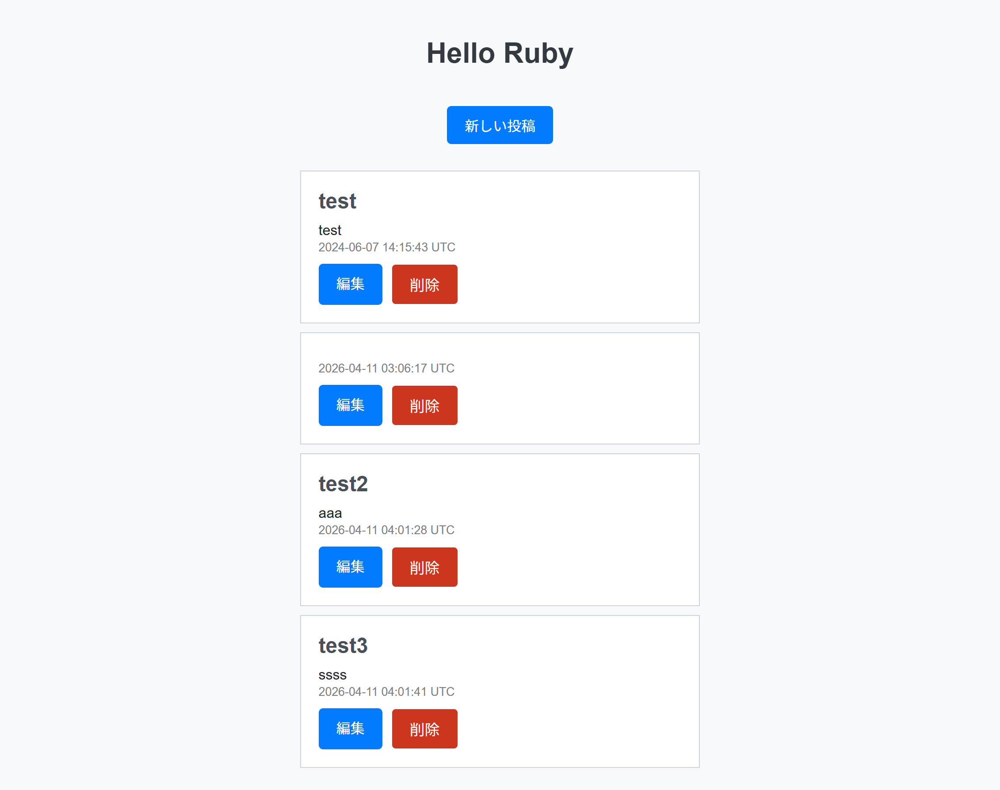
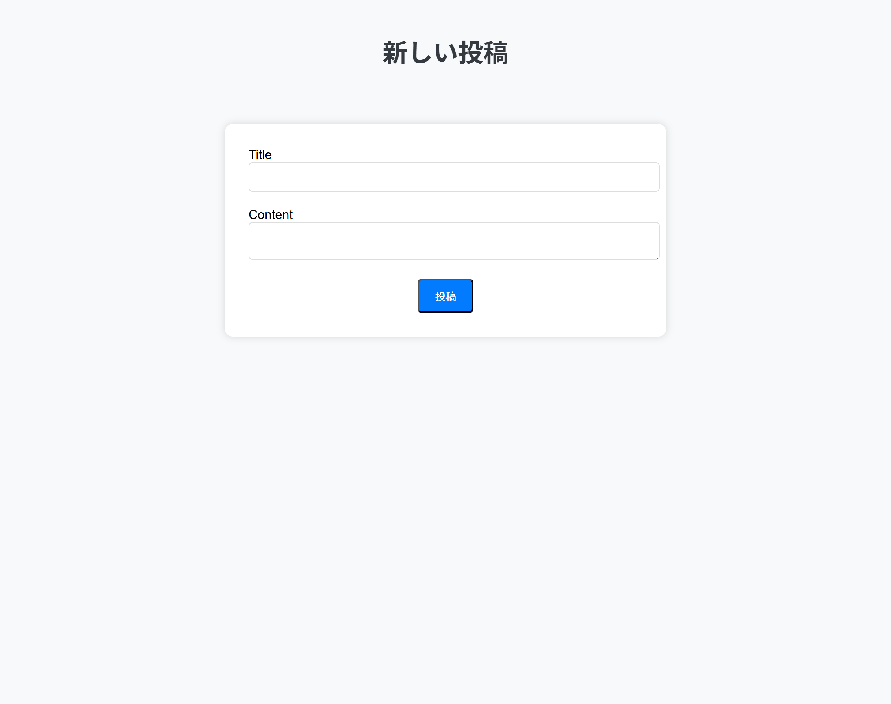
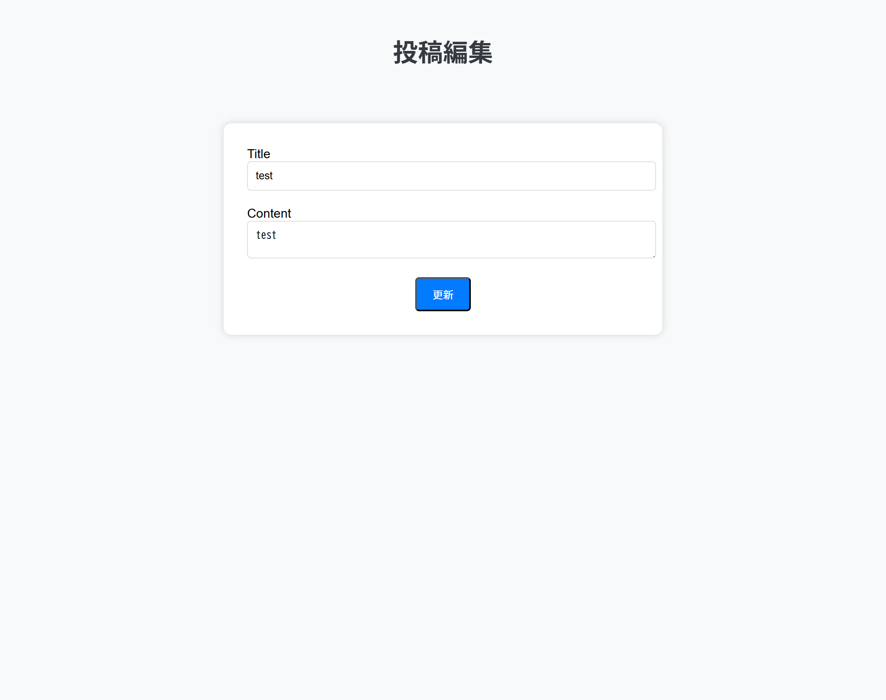

# 簡易BBS（掲示板）アプリ

## 概要

Ruby on Rails を使用して作成した簡易掲示板アプリです。  
投稿フォームからタイトルと本文を入力すると、一覧に追加されます。

※学習目的で作成したアプリです。

## 使用技術

### Backend

- Ruby 3.x
- Ruby on Rails 7.x
- MVC アーキテクチャ
- ActiveRecord（ORM）

### Database

- SQLite3（開発環境）

### Frontend

- HTML / CSS
- ERB（Embedded Ruby）
- Rails ヘルパー（link_to, button_to, form_with など）

### 機能

- 投稿の CRUD（作成 / 一覧 / 編集 / 更新 / 削除）
- Strong Parameters による安全なパラメータ受け渡し
- before_action による共通処理の切り出し
- Rails 標準の CSRF 対策

- ## 画面イメージ
  
  
  

## 今後の改善点

- バリデーションの追加
- 投稿の並び順を新しい順に変更
- UIデザインの改善

## 参考にした教材

【Ruby on Rails入門】初心者OK！掲示板アプリを作りながら学ぶRuby on Rails入門  
https://www.youtube.com/watch?v=CfdRXSrwLDo
